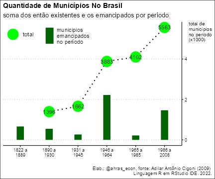

---
---
---

# Emancipação de Municípios Brasileiros

Este repositório é um exercício de extração e tratamento de dados em tabelas num documento PDF. A fonte é a tese de doutorado de Adilar Antônio Cigolini, entitulada TERRITÓRIO E CRIAÇÃO DE MUNICÍPIOS NO BRASIL: Uma abordagem histórico-geográfica sobre a compartimentação do espaço - defendida em 2009 na UFSC.

# Objetivo

Demonstrar as possibilidades de automatização e compartilhamento das atividades na linguagem R que envolvem dados em documentos PDF. Apesar de ter como fonte uma tese de doutorado, é possível extrapolar este exercicio para documentos padronizados de publicação frequente e automatizar atualização de dados e análises. Você pode clonar este repositório e rodá-lo imediatamente. Ele deve apresentar, ao final, os gráficos propostos, assim como as tabelas criadas.

### Exemplo de tabela do documento PDF e a tabela gerada neste repositório:

{width="15cm"}

{width="15cm"}

### Exemplo de gráfico gerado:

## Observação

Atente-se aos pacotes necessários à execução do script.

# Resumo da execução

O script, portanto, executa as seguintes ações:

-   Download do PDF utilizado para uma pasta temporária;
-   Extração das tabelas utilizadas nos gráficos;
-   Tratamento dos dados e formato das tabelas;
-   Unificação dos dados em uma tabela única e tratada para a plotagem dos gráficos.
-   Plotagem dos gráficos propostos.
